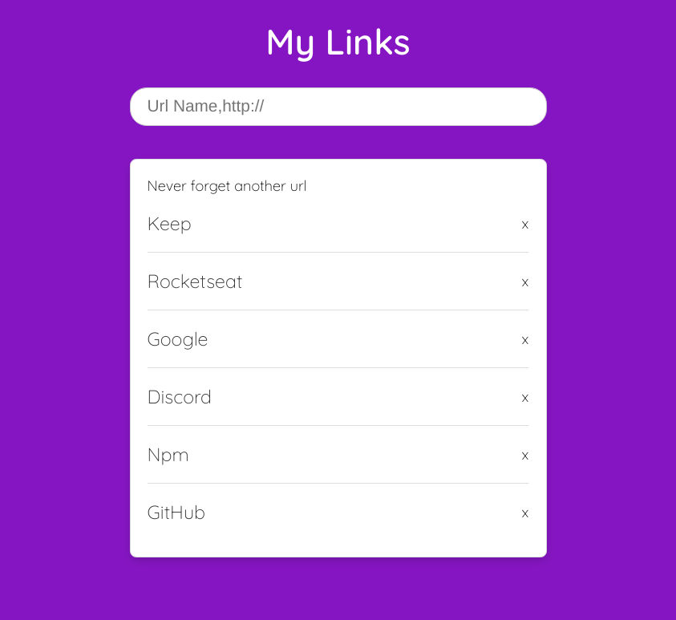

# LinksList
Record links that matters for you

## How to run the project
There are two servers in this project: an API to read, write and delete items, and another to serve the web page.

* To run API

```bash
cd http
npm run api
```

* To run WebServer

```bash
cd http
npm start
```

## How it works

<p align="center">
  
</p>

Type `localhost:5000` on the browser, write the informations into the input, press `Enter` and it's done.
